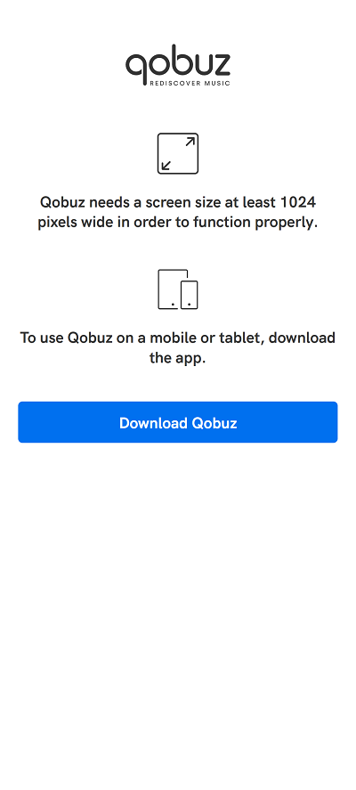
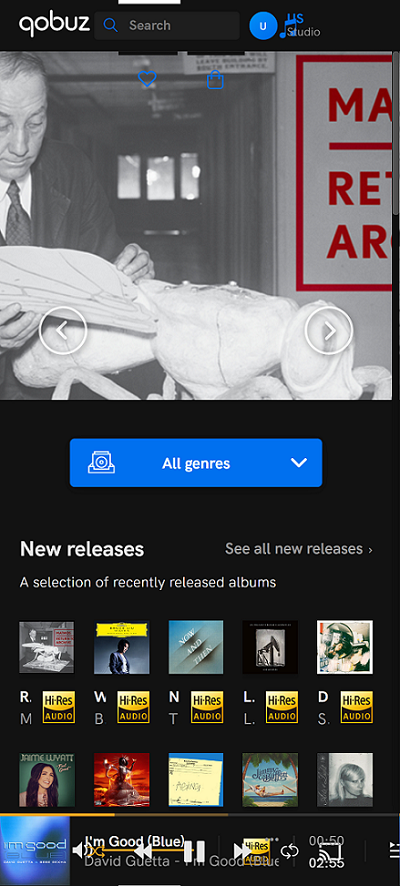

# Qobuz-Mobile-Unlock

Unlocks the Qobuz Web Player on small browser windows and mobile devices by removing the blocking mobileOverlay element that is inserted on top of the normal web player when the screen resolution is to small.

 

Some notes about the script:

- It might break at any time if Qobuz makes a change to their Web Player.
- Some elements that rely on the mobileOverlay won't work (correctly). An example is the "What's New" menu item, which will result in a blank page. Manually refreshing the page should solve this (not going to waste time looking for an automatic solution to this...).
- The Qobuz Web Player is not designed to scale well on mobile devices (see example screenshot above, hence the native apps).  
  I recomment enabling the "desktop site" option for play.qobuz.com on mobile devices for the best results.

Tested with Tampermonkey on desktop with Brave (should also work in Chrome) and Firefox.  
Tested with Tampermonkey in Kiwi Browser and Firefox on Android.

## Installing

Install [the script](https://github.com/DJDoubleD/Qobuz-Mobile-Unlock/raw/master/qobuz-mobile-unlock.user.js) using your prefered userscript manager.

## Usage

Just activate the script in Tampermonkey before visiting play.qobuz.com. The script should automatically remove the mobile overlay (shown in the into above).  
Should the overlay still be shown, just refresh the page.
